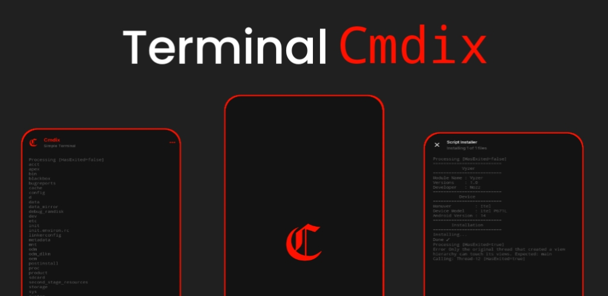
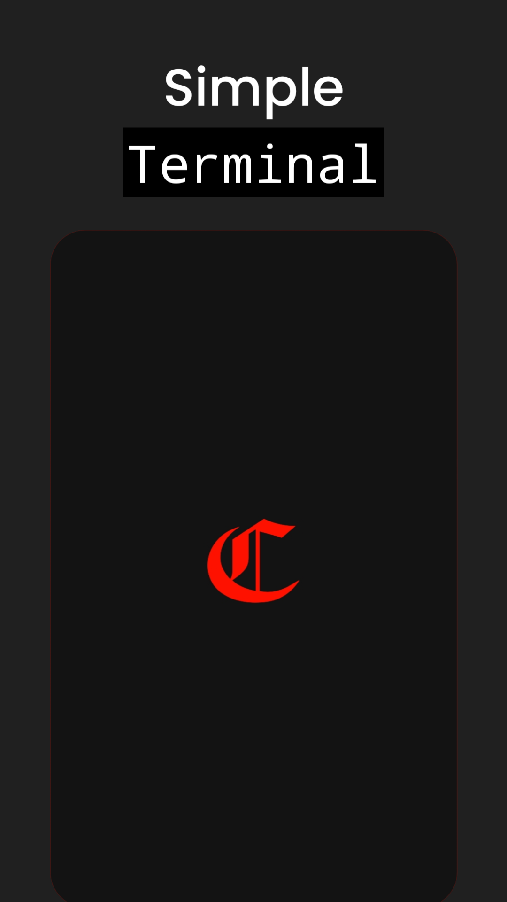
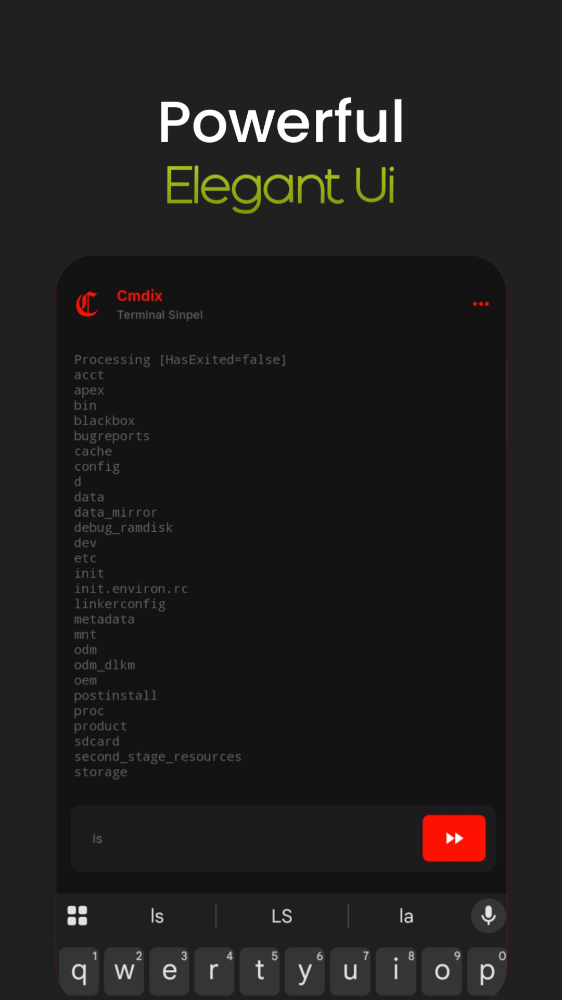
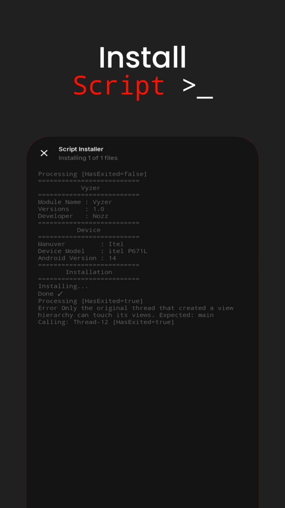

  

# Cmdix
> [!TIP]
> Application is specifically designed `for Android 9+` devices. 

Cmdix is a versatile, flexible, and easy-to-use Android terminal application tool., connected with Shizuku, this application is specifically `for Android 9+` users.Made by **Nozz Trick** using **_Skectware Pro_**

# Feature
- Modern and Minimalist UI
- Running a Shell (With Shizuku)
- Run .sh Files with One Click
- Available in two languages: Indonesian and English 

# Credit
- [Sketchware Pro]() Application Development 
- [Shizuku](https://github.com/RikkaApps/Shizuku)/[API](https://github.com/RikkaApps/Shizuku-API) Providing More Access To Apps
# Screenshot

  
  
  
  

# Support
- [YouTube Channel](https://youtube.com/@nozztr) Support and follow the development of this project
- [Contact Me](nozzdev16@gmail.com) Report bugs or request collaboration 

# Donation

 

